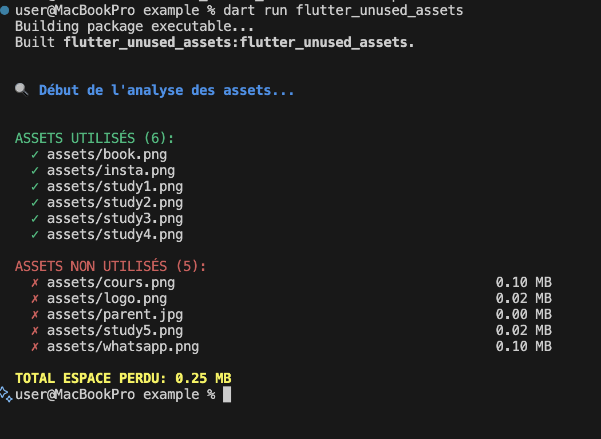

The `flutter_unused_assets` package generates a report of unused assets in your Flutter application, allowing you to optimize your app by removing unnecessary files. This helps in reducing the app size and improving performance.

## Features

- **Asset Analysis**: Scans your Flutter project to identify unused assets.
- **Detailed Report**: Generates a comprehensive report listing all unused assets.
- **Optimization Suggestions**: Provides suggestions on how to optimize your project by removing unused assets.
- **Easy Integration**: Simple to integrate into your existing Flutter workflow.
- **Cross-Platform**: Works on both Windows and macOS environments.



## Getting started

### Prerequisites

- Dart SDK installed on your machine.
- Flutter SDK installed on your machine.

### Installation

You can activate the package globally using the following command:

```bash
dart pub global activate source=git https://github.com/Engel-Rich/flutter_unused_assets.git
```

Alternatively, you can add it to your project's dev dependencies and run it from the project directory:

1. Add the package to your `pubspec.yaml`:

```yaml
dev_dependencies:
    flutter_unused_assets:
        git:
            url: https://github.com/Engel-Rich/flutter_unused_assets.git
```

2. Run the following command in your project directory:

```bash
dart run flutter_unused_assets
```

## Usage

TODO: Include short and useful examples for package users. Add longer examples to the `/example` folder.

```dart
const like = 'sample';
```

### Help Command

To get a list of all available commands and options, you can use the help command:

```bash
flutter_unused_assets --help
```

<!-- ## Additional information

TODO: Tell users more about the package: where to find more information, how to contribute to the package, how to file issues, what response they can expect from the package authors, and more. -->

# Flutter Unused Assets Analyzer

A CLI tool to analyze and detect unused assets in Flutter projects. This tool helps developers maintain a clean and optimized codebase by identifying and suggesting the removal of assets that are no longer in use. By integrating this tool into your workflow, you can ensure your Flutter applications remain efficient and performant.

## Installation

```bash
dart pub global activate source=git https://github.com/Engel-Rich/flutter_unused_assets.git
```
